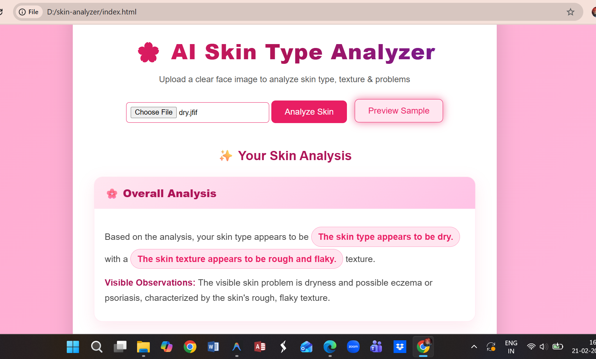
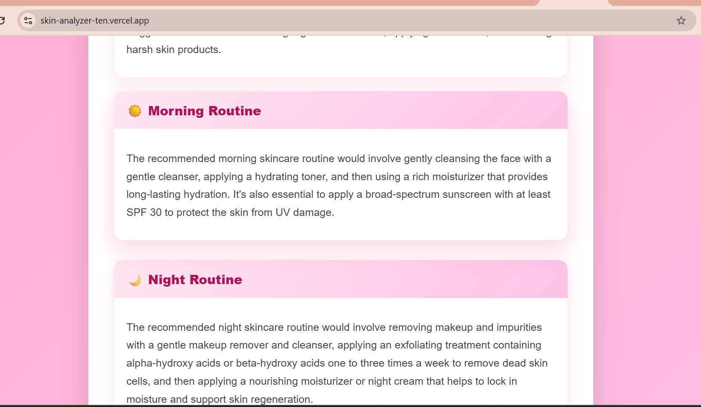

<p align="center">
  
</p>

# SKIN-ANALYZER 🎯

## Basic Details

### Team Name: Sneha Nasba

### Team Members
- **Member 1:** Sneha Shine - St Joseph's College, Devagiri
- **Member 2:** Nasba Fathima A R - St Joseph's College, Devagiri

### Hosted Project Link
https://skin-analyzer-ten.vercel.app/
### Project Description
Skin-Analyzer is a web application that analyzes facial skin using AI and provides personalized skincare insights. The system detects skin type, texture, and issues, and suggests suitable skincare routines for morning and night.

### The Problem statement
Many people struggle to understand their skin type and conditions. Visiting dermatologists frequently can be costly and time-consuming. There is a need for a simple, accessible tool that helps users analyze their skin instantly and receive personalized skincare guidance.

### The Solution
Skin Analyzer allows users to upload a clear photo of their face. The AI model processes the image and returns:
- Skin type detection (Oily, Dry, Normal, Combination, Sensitive, Aging)
- Skin texture analysis
- Visible skin problems (Acne, Dark spots, etc.)
- Suggested remedies
- Personalized daily skincare routine (Morning & Night)

This makes expert-level skincare guidance accessible anytime and anywhere.

---

## Technical Details

### Technologies/Components Used

**For Software:**
- **Languages:** HTML, CSS, JavaScript
- **Frameworks:** None (Pure Vanilla Web App)
- **APIs:** Groq Vision API (llama-3.2-11b-vision-preview)
- **Tools:** VS Code, Git, Web Browser

---

## Features

- **Instant Skin Analysis** – Upload a face image and get results in seconds.
- **AI-Based Recommendations** – Personalized skincare routines for morning & night based on your exact profile.
- **Visual Highlights** – Key points displayed in attractive, beautifully styled cards.
- **User-Friendly Interface** – Simple, modern animated design and easy navigation.

---

## Implementation

### Software Workflow

1. User uploads a clear face image via the web interface.
2. JavaScript `FileReader` converts the image to a base64 encoded string.
3. The Base64 image is sent securely to the **Groq Vision API** along with a strictly formatted JSON parsing prompt.
4. The Groq API analyzes the image and returns a JSON payload with the skin analysis.
5. JavaScript parses the JSON and dynamically renders the results into visually highlighted HTML cards with headings, key points, and suggestions.

### UI/UX Details

- Clean, vibrant gradient-based background with continuous smooth animations.
- Interactive hover effects for buttons and result cards.
- Fully responsive layout ensuring the app works perfectly on mobile and desktop devices.
- Important data points highlighted with custom chips for quick readability.

### Installation & Run

1. Clone or download the repository.
2. Ensure you have your `env.js` file properly set up with your Groq API key in the root directory:
   ```javascript
   const ENV = {
       GROQ_API_KEY: "your_api_key_here"
   };
   ```
3. Since it is a pure front-end web application, you do not need to run any package managers like npm or Python.
4. Simply double-click and open `index.html` in your favorite web browser!

---

## Project Documentation

### Screenshots

*(Add screenshots of your application here)*

<!-- Remove comments and add actual paths once you take screenshots -->
<!-- 

*Caption: Landing page of the Skin Analyzer*


*Caption: Uploading the image & loading animation*


*Caption: AI-Generated Skin Analysis Results*
-->

---

## Project Demo

### Video
*(Add your demo video link here - YouTube, Google Drive, etc.)*

*Caption: A short demonstration of analyzing a face image and receiving skincare insights.*

---

## AI Tools Used

**Tool Used:** Cursor / Google DeepMind Agent
**Purpose:** Code refinement, UI/UX styling, Refactoring API response parsing logic, and README document formatting.
**Human Contributions:** 
- Architecture design and planning
- Initial business logic implementation
- UI structure and layout rules
- Prompt engineering for the Groq API

---

## Team Contributions

- **Sneha Shine:** *(Add specific contributions here - e.g., Frontend UI/UX design, CSS animations, etc.)*
- **Nasba Fathima A R:** *(Add specific contributions here - e.g., API integration, JavaScript logic, JSON conversion, etc.)*

---

## License

This project is licensed under the MIT License - see the [LICENSE](LICENSE) file for details.

---

Made with ❤️ at TinkerHub
